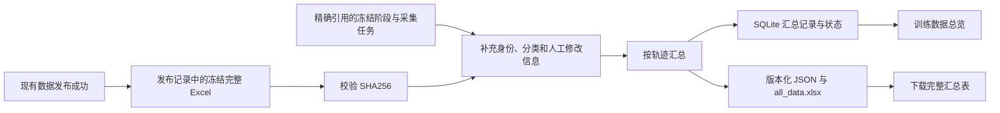

# 训练数据总览与 DataVue 汇总格式

训练数据总览使用本项目已有 FastAPI 后端与 SQLite。页面入口为
`/data-publishing/overview`，默认场景视角，`?view=app` 为 App 视角。以仓库提供的 DataVue 原版为内容、布局、交互和统计基准，仅替换为项目配色；不需要启动参考项目的 Flask 服务，
也不需要手动上传 `all_data.xlsx`。

## 数据来自哪里

支持平台流程发布和[外部完整步骤表上传发布](../data_publishing/EXTERNAL_IMPORTS.md)。外部发布以冻结原件、校验后的规范化 JSON 和导入清单为来源，不读取纠偏会话；按上传时指定的数据日期和来源累计，其余查询与图表口径保持一致。



- 每份已登记发布的完整 Excel 是步骤收录范围的依据，读取前验证发布时的校验值。
- 冻结阶段 JSON 用于补充身份、分类和人工修改信息，不代替完整发布表。
  现有 `rel_a9ef8163fbd61a10` 的完整表有 142 步，而相关 COT 快照只有 5 步；
  用 COT 快照统计全量会漏记其余步骤。
- 关联只沿发布记录引用的精确版本读取，不使用当前会话、最新任务、当前知识库，
  不扫描旧目录，不重新调用模型。
- 发布完成后排队转换；转换失败不撤销发布，且与云道S3是否上传成功无关。
  后端启动时检查当前登记的发布，补齐尚未转换的记录并恢复中断转换。
- 同一发布重复转换不重复累计；不同发布版本分别累计。一次发布的全部文件转换成功后才纳入汇总，
  失败文件不会导致该发布只计入一部分步骤。
- 不改变完整发布表的收录范围，不在汇总层重新执行删除、勾选、SFT／RL 分流。

## `all_data.xlsx` 字段

一条完整轨迹对应一行；当前没有独立子任务拆分，因此子任务记录数与完整轨迹数相同。

| 字段 | 格式与来源 |
| --- | --- |
| `轨迹` | 发布编号、文件序号和原轨迹身份构成的稳定唯一标识；跨批次同名轨迹不会合并 |
| `子任务轨迹` | 当前与完整轨迹一一对应的稳定唯一标识 |
| `step数量` | 最终冻结发布表中该轨迹实际包含的步骤数 |
| `APP` | 平台流程使用冻结采集任务的 App；外部表内优先、表单补缺；仍缺失使用“未记录 App” |
| `一级场景` | 平台流程使用冻结任务 L1；外部表内优先、表单补缺；仍缺失使用“未分类” |
| `二级场景` | 平台流程使用冻结任务 L2；外部表内优先、表单补缺；仍缺失使用“未分类” |
| `时间` | 平台流程为发布时间换算北京时间；外部表为指定的数据日期，与真实发布时间分别保存 |
| `生产方式` | 平台流程为“数据飞轮”；外部表使用填写的来源，默认“人工采集” |
| `人工精修步骤数量` | 最终发布内容中生效的人工动作或 SOP 修改步数，同一步只计一次；无法确认的记录保持未知 |
| `action_box` | 最终动作类型到出现次数的字典文本，兼容参考平台读取；不是坐标字段 `actions_box` |

编号和文本按文本保存。自动生成 COT、单独修改标框、Summary 或 Thought 不计入人工精修。
如果人工修改没有生效到最终发布内容，也不计入。

缺少历史分类允许纳入并使用缺失标签；明确引用的文件缺失、损坏，或身份关联存在歧义，
会使转换失败并显示原因，不能退回最新数据或静默改成“未分类”。

## 看板统计口径

2026-09-20 起按 DataVue 原版计算；现有汇总行和发布文件保持原字节，仅查询统计方式调整。

- 轨迹卡按轨迹身份去重，子任务卡按当前筛选后的汇总记录行数统计；总步数为 step数量 合计，平均步数为总步数除以去重轨迹数。
- 趋势按每日轨迹／子任务去重数和步骤合计逐日累计；同一轨迹若跨日出现，曲线累计值可与总体去重卡片不同。
- App 和场景类别按表中非空值去重，包含已有的“未记录 App”“未分类”标签；二级场景按名称去重。
- App／场景柱图统计各组的去重轨迹、去重子任务和步骤合计；场景标签按原版“一级-二级”组合。
- 任务步数饼图按轨迹汇总 step数量 后减去该轨迹的记录数（原版子任务数），总步骤卡不执行此扣减。
- 人工精修卡仅在当前结果包含生产方式含“数据飞轮”的记录时显示，只对这些记录求和；缺失／非数值按零处理。原始汇总字段中的未知值仍保留，诊断信息放在发布详情。
- 场景视角以来源、场景联动 App 选项；App 视角以来源、App 联动场景。未选一级场景时禁用二级；切换视角独立初始化。日期与快捷日期按原版行为，修改筛选后点击“搜索”才刷新图表。
- 转换继续在后台自动执行；总览不显示转换管理、下载、统计说明和警告板块。发布详情按发布编号展示转换状态与警告，提供重试／校验及“下载完整汇总表（全部发布）”；下载不受看板筛选影响。

## 保存位置与恢复

默认数据根为项目根目录的 `backend_workspace/`，可由 `ADF_DATA_ROOT` 覆盖。

```text
backend_workspace/
└─ system/
   ├─ app.sqlite
   └─ training_data_overview/
      └─ exports/<version>/
         ├─ all_data.xlsx
         ├─ all_data.json
         └─ conversion.json
```

`all_data.json` 保存该版本的全部汇总行，`conversion.json` 保存本次发布的转换结果。
SQLite 的 `training_overview_conversions` 命名空间保存逐发布转换状态，
`training_overview_catalog` 的 `current` 记录保存当前汇总和版本。状态为
`queued`、`running`、`succeeded`、`failed`。启动时自动补齐缺失记录并恢复
`queued`／`running`；已明确失败的转换等待人工重试。

版本文件完整写入后才切换当前版本，
读取期间不会暴露半成品。看板查询读取已保存汇总，不在每次访问时重新解析 Excel。
发布源文件保持原字节，不被汇总转换修改。

转换失败后在发布详情查看原因并重试；重复点击复用现有执行任务。已成功且文件健康时重试返回原结果；
如果派生文件或当前汇总文件缺失、校验失败，校验／重试会基于原冻结发布重新生成。
它不能修复已经损坏的发布源文件。恢复源文件时必须恢复其原内容，
使 SHA256 与冻结登记一致；不要直接改发布清单掩盖损坏。

备份时保留 `system/app.sqlite`、`system/training_data_overview/`，以及引用的
`releases/`、`batches/` 和冻结采集记录。恢复应使用一致版本，不能只复制汇总 Excel 代替状态库。

## 接口

以下接口均位于现有后端，不新增参考平台的独立 API 服务。

| 方法与路径 | 用途 |
| --- | --- |
| `GET /api/training-data-overview` | 返回筛选选项、规模卡片、图表数据、汇总版本和转换状态 |
| `GET /api/training-data-overview/workbook` | 下载当前完整 `all_data.xlsx`，不接受页面筛选范围作为导出范围 |
| `POST /api/training-data-overview/releases/{release_id}/retry` | 重试失败发布的汇总转换；重复调用复用执行中的任务 |

总览 GET 的可选查询参数为 `source`、`level1`、`level2`、`app`、`start_date`、`end_date`。
空字符串表示不限制；日期使用 `YYYY-MM-DD`，起止日期均包含。非法日期或起始晚于结束返回 `422`。

GET 直接返回对象（无 `data` 外层）：

```json
{
  "schema_version": 1,
  "version": "<汇总版本>",
  "updated_at": "<更新时间>",
  "overview": {
    "total_trajectories": 10, "subtask_trajectories": 10, "total_steps": 142,
    "manual_refine_steps": 0, "show_manual_refine_steps": true, "manual_known_steps": 0, "manual_unknown_steps": 142,
    "level1_scenes": 1, "level2_scenes": 1, "total_apps": 1, "avg_steps_per_trajectory": 14.2
  },
  "filters": {
    "sources": ["数据飞轮"],
    "scenes": [{"name": "未分类", "level2_scenes": ["未分类"]}],
    "apps": ["未记录 App"],
    "date_range": {"min_date": "<北京时间日期>", "max_date": "<北京时间日期>"}
  },
  "trend": [], "app_stats": [], "scene_stats": [], "action_stats": [], "step_stats": [],
  "conversions": [], "warnings": [],
  "workbook_url": "/api/training-data-overview/workbook"
}
```

上例用于说明字段；图表数组省略，人工精修覆盖值不代表现有发布的实际验收结果。
`show_manual_refine_steps` 决定人工精修卡显隐，`manual_refine_steps` 按 DataVue 的缺失值计零方式汇总；
`manual_known_steps`／`manual_unknown_steps` 表示覆盖的步骤数，不是修改步数。

- `trend` 项包含 `date` 和三项累计计数；`app_stats` 项包含 `name` 和三项计数。
- `scene_stats` 项包含 `name`、`level1`、`level2` 和三项计数；名称按 DataVue 使用一级、二级场景以连字符连接。
- `action_stats` 项为 `category`／`count`；`step_stats` 项为 `steps`／`count`。
- `conversions` 项为 `release_id`、`name`、`status`、`error`、`warnings`、`updated_at`。
- 无成功汇总时，`version`、`updated_at`、`workbook_url` 为 `null`，卡片为零、图表为空。
- 下载无当前表返回 `404`，文件缺失或校验失败返回 `409`；正常返回 Excel 附件。
- 重试返回 `202` 和 `{"conversion": {...}}`；发布不存在返回 `404`，值冲突返回 `409`。
- 查询和下载返回 `Cache-Control: no-store`，重试不改变已有发布文件。

当前使用单进程后端中的串行工作线程执行转换。若未来改为多个后端进程，需要共享队列和跨进程
作业领取机制，不能直接让多个实例同时运行本地转换调度。

## 验证边界

2026-09-20 对齐 DEV 后的验证：

- 相关后端测试 35 项通过，统计测试直接读取原版 Python 函数，逐项比较同一组模拟数据的卡片、趋势、分类、分布和筛选选项。 对照使用的两个视角、原版样式和统计代码均已核对，与 DataVue.rar 内文件逐字节一致。
- 全量前端测试 237 项通过，生产构建通过；包含原版筛选交互、异步响应隔离、图表配置以及发布详情的状态轮询和重试测试。
- 以只读连接核对当前发布，轨迹／子任务／总步骤仍为 10／10／142，人工精修为 1；现有“未记录 App”“未分类”计为各 1 种类别。任务步数分布扣除 10 条子任务记录，加权合计为 132，总步骤卡和原始汇总行仍为 142。
- 模拟浏览器以相同数据和内容宽度加载原版 SceneView／AppView 与当前生产构建；模块文字、位置、尺寸、字体、内边距逐项对照通过。四张图表配置剔除颜色字段后完全一致；动画完成后的两视角截图也已逐一检查。
- 总览级联筛选、快捷日期延后搜索、独立视角初始化、人工卡显隐、空结果和失败提示通过；发布详情的失败重试、成功校验、警告、完整汇总表下载、关闭停止轮询和迟到响应隔离通过。云道S3与发布后批次清理的浏览器回归均通过，全程使用本地模拟接口。
- 数据库、发布快照、批次过程件、原始采集文件和已有汇总产物共 3069 个文件逐一核对 SHA256，全部未变化，无新增数据文件。

以下是对齐 DEV 之前的历史验收记录；其中 App／场景种类数与任务步数分布采用旧查询口径，不作为当前看板预期。

2026-09-19 对现有发布 `rel_a9ef8163fbd61a10` 的本地验收结果：

| 项目 | 实际结果 |
| --- | --- |
| 轨迹／子任务／步骤 | 10／10／142 |
| 人工精修步骤 | 1；142 步均有可核对的人工记录 |
| App、一级和二级场景 | 历史分类显示未记录，真实种类数均为 0 |
| 汇总版本 | `3f6208efdb364284b6cae49e978acd78` |
| 完整汇总 Excel | `system/training_data_overview/exports/3f6208efdb364284b6cae49e978acd78/all_data.xlsx` |
| 源发布 Excel SHA256 | `dd4a12aad4e07af2a5d38713b8333b3085f5cbf9a55a6d8b630976693469c5e0`，转换前后未变化 |
| HTTP 下载 | 下载内容 SHA256 与本地汇总文件一致 |
| 后端重启 | 当前汇总版本、10／10／142／1 及成功状态保持不变，不重复转换 |

上述路径相对于数据根，版本表示验收时的当前汇总，后续发布或重建会产生新版本。
本次验证读取现有冻结发布，不重新执行采集、模型或发布；转换成功不代表已上传云道S3。

隔离测试使用临时数据、冻结文件和模拟 API，覆盖重复转换、并发、重启、损坏、关联及人工修改。
浏览器测试位于 `frontend/tests/training-data-overview.browser.cjs`，使用本地生产构建和模拟接口，
阻止外网请求，截图输出到操作系统临时目录（可用 `ADF_BROWSER_ARTIFACTS` 覆盖）。
测试不向真实模型、手机或云道S3发送请求。

2026-09-19 的浏览器隔离验收通过两视角、App／日期筛选、空态、接口错误刷新、延迟旧回包隔离、
转换失败重试、下载 `409` 后校验恢复、离开路由时样式及图表清理；
1440、1024、390 像素宽度截图已实际检查，页面无脚本错误。

```powershell
cd frontend
npm test
npm run build
node tests/training-data-overview.browser.cjs
```

运行浏览器测试需要本机可用的 Playwright 和 Edge；可通过 `PLAYWRIGHT_CHANNEL` 选择其他已安装浏览器。
