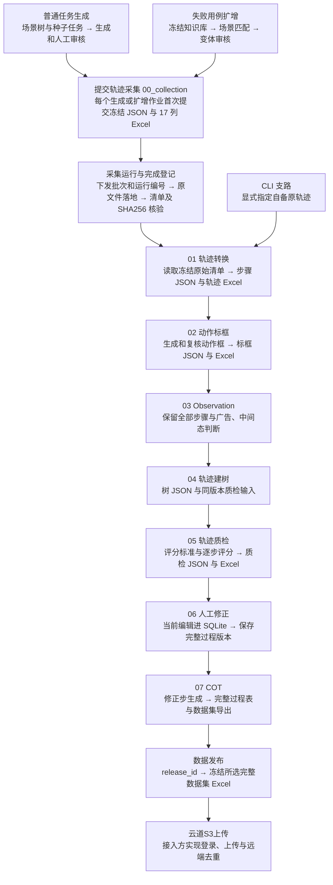
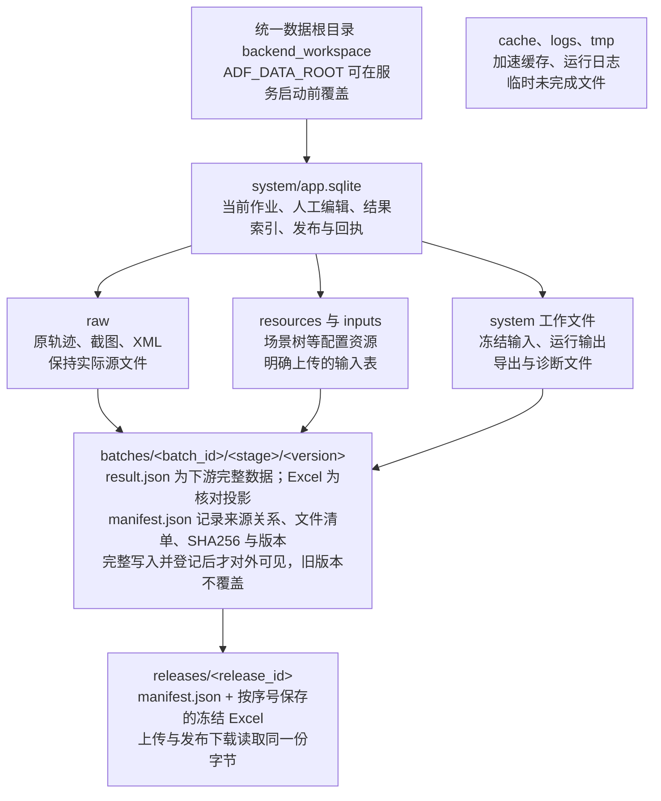

# 数据流转与存储设计

`AgenticDataFlywheel` 业务流程和维护说明

适用对象：业务使用者、后端维护工程师和采集及云道S3接入同事  
版本日期：2026年9月16日

系统统一使用 `backend_workspace` 作为运行数据根目录。模块之间读取结构化 `JSON`，当前作业和人工编辑保存在 `SQLite`；各阶段保留可下载的 `Excel` 核对表。原轨迹、图片和 `XML` 继续保存为文件，并通过批次、轨迹和版本标识关联。这样既能按批次追溯全过程，也能维持现有人工审核和表格交付方式。

## 三种数据形式的职责

| 形式 | 保存内容 | 使用方式 |
| --- | --- | --- |
| `SQLite` | 当前作业状态、结果、人工编辑、索引和上传回执 | 通过后端事务读写；不是供用户手改的表格 |
| `JSON` | 冻结输入、完整步骤、阶段结果、上游关系和版本信息 | 作为模块间数据协议；必需文件缺失或校验失败时停止 |
| `Excel` | 阶段核对表、采集输入表及训练数据交付表 | 供查看、下载和交付；修改已导出表不会回写当前数据 |

## 最重要的使用规则

先通过页面保存人工修改，再导出或提交下游。一次阶段完成会新增版本，已经发布的版本保持不变。文件名、批次号和页面任务状态各有用途，不能用某个 `Excel` 的存在代替成功状态，也不能根据目录名称猜测任务身份。

业务 `API` 地址继续保留。停用的是旧目录扫描和旧文件回退；后端不再从历史工作目录、旧 `JSON` 或旧 `Excel` 中自动恢复当前结果。业务下载响应指向本次保存的文件，浏览器下载副本仍进入用户自己的下载目录。

## 本次真实验证范围

实例批次 `validation-20260915-155706` 已从自备原始轨迹处理到 `05_quality`，包含 10 条轨迹和 142 个步骤。本次没有重新执行真实手机采集，没有继续修正、`COT`、数据发布或云道S3上传。作业技术完成仍需要人工核查模型判断。

## 01 业务全链路



箭头表示数据关系，每一步仍由各自按钮或作业触发，本图不代表全部自动执行。

图1 业务数据关系与触发顺序

页面预处理只执行转换和标框。`Observation` 与中间态判断在建树任务中执行，随后保存 03 和 04 两个阶段版本。质检、修正、`COT`、发布和上传仍由各自入口触发，不因前一阶段完成而自动全部执行。

## 02 存储关系与目录



`SQLite` 管当前状态，`JSON` 传完整版本，`Excel` 供人查看和交付。

`raw` 和 `resources` 仍必须保留，单独备份数据库或 `Excel` 都不完整。

图2 当前状态 工作文件 阶段版本与发布版本的关系

默认绝对根目录为 `D:\work\Code\AgenticDataFlywheel\backend_workspace`。文中后续路径均相对这个根目录；部署时可在启动前设置 `ADF_DATA_ROOT`。`backend_workspace` 下直接放 `system`、`batches` 等目录，不再套一层 `data`。

`system` 是业务工作区，其中可能有输入快照、运行 `JSON`、导出 `Excel` 和诊断文件；`batches` 是按阶段登记的可追溯版本。可变作业状态与人工编辑只进入 `system/app.sqlite`，不双写成另一套可变 `JSON` 状态库。

```text
batches/<batch_id>/<stage>/<version>/
  result.json    result.xlsx 或原导出文件名    manifest.json
```

清单中的 `files` 给出实际文件名、相对路径、大小和 `SHA256`；`source_refs` 记录上游版本及资源。建树阶段主要保存 `JSON`，不要求为树强行增加一份无业务意义的 `Excel`。

## 03 任务生成 扩增与采集批次

### 生成和扩增如何形成输入

普通生成读取场景树和种子任务，扩增先上传失败用例并冻结知识库快照，再分类并保存关联路径。点击开始扩增后直接消费已保存的分类结果，不再次分类。页面审核、人工修改和删除更新 `SQLite` 当前值；筛选、分页和折叠只影响展示。

任务生成结束保存 `00_task_generation`，扩增分类结束保存 `00_scene_matching`，扩增完成保存 `00_augmentation`。人工保存不会为每次按键生成 `Excel`；需要额外中间表时可请求当前结果 `snapshot`，不调用模型。

### 第一次提交采集冻结什么

普通生成和扩增共用 `collection-batch` 接口。只有 `succeeded` 或 `partial` 且存在有效未删除任务时可首次提交。系统校验编号、任务、`App` 和依赖引用，冻结当前全部未删除结果；后续修改源任务不会改动已提交批次，重复提交返回同一个批次。

```text
system/task_generation/collection_batches/<batch_id>/
  batch.json    collection-batch-<batch_id>.xlsx
batches/<batch_id>/00_collection/<version>/
```

| 采集列 | 来源 | 规则 |
| --- | --- | --- |
| 用例编号 | `collection_case_id` | 普通生成沿用 `task_id`；扩增优先原 `case_id`，缺失回退 `task_id` |
| `单APP跨APP` | 固定值 | `单APP` |
| `涉及APP` | `app` | 对应场景树 `L4` |
| 一级场景 | `scene` | 对应 `L1` |
| 二级场景 | `capability` | 对应 `L2` |
| 三级场景 | `sub_capability` | 对应 `L3` |
| 任务 | `task` | 采用提交时已保存的文本 |

后十列保留表头并留空：难易程度、页面关键元素、预期步数、用例来源、构建人、任务结束标志、任务复杂度、关键动作、`SOP`、动态变量说明。

`JSON` 继续保留主任务、前置任务、强依赖和原行状态。17 列 `Excel` 不承担依赖调度，也不能把扩增任务默认解释成无依赖。

## 04 采集完成与轨迹预处理

### 原始文件先落地 再登记完成

采集侧选择批次本身不启动手机。点击运行后先幂等登记采集 `Excel`，再下发 `batch_id`、`collection_run_id` 和 `output_dir`。远端采集服务必须把最终文件写到本后端能够读取的位置，并通过完成接口回传全部文件的相对路径和 `SHA256`。路径字段不会自动传输文件。

```text
raw/collection_batches/<batch_id>/runs/<collection_run_id>/
  <collection_case_id>/<原轨迹目录>/ 原始 JSON 图片 XML
```

完成登记校验批次、用例身份、完整目录和文件字节。相同清单重复回传不产生新记录；补采使用新的 `collection_run_id`。只有 `completed` 清单中的可用轨迹进入预处理，下发回执或页面运行中状态都不等于轨迹已就绪。

### 转换与动作标框

开始预处理时冻结该批次当前所有可用采集结果，保存 `input.json` 及输入摘要。`01_conversion` 将 `response`、图片和 `XML` 等转换为统一步骤 `JSON` 与轨迹 `Excel`，不调用模型。`02_annotation` 读取转换 `JSON`，生成并复核动作框，保存完整标框 `JSON` 与 `Excel`。标框失败时已完成的转换版本仍可下载。

```text
system/preprocessing/<batch_id>/<job_id>/input.json
batches/<batch_id>/01_conversion/<version>/
batches/<batch_id>/02_annotation/<version>/
```

点击保存 `bbox` 时携带 `batch_id` 和 `annotation_version`，后端校验当前版本后发布新的 02。页面继续使用明确版本读取任务、轨迹和图片；建树提交也冻结这个版本，避免跨批次或同名轨迹串用。

### 自备原轨迹的 CLI 入口

自备数据先显式复制到 `raw/rollout_trajectories`，保留任务和轨迹层级。该支路不补造生成任务或真实采集登记；脚本尊重显式输入路径。

```powershell
python backend/trajectories_preprocessing.py --source "backend_workspace/raw/rollout_trajectories" --batch-id my-batch

python backend/export_vla_trajectories.py "backend_workspace/raw/rollout_trajectories" --batch-id my-batch
```

第一条执行转换和标框，第二条只转换。默认工作文件按批次与本次执行隔离；显式 `--export-output` 或 `--annotated-output` 才覆盖默认输出位置。

## 05 Observation 建树与质检

| 阶段 | 输入与触发 | 保存内容 |
| --- | --- | --- |
| `03_observation` | 页面提交建树后读取冻结的 02 `JSON` 和对应图片 | 所有步骤的 `Observation`、中间态或广告类别、判断原因和是否计入树；`JSON` 与 `Excel` |
| `04_tree` | 与 03 属于同一建树作业，基于已保存视觉判断构建 | 树 `JSON`、来源轨迹身份以及同版本完整质检输入 |
| `05_quality` | 在轨迹质检页选任务集和任务后启动 | 评分标准、逐步与全轨迹评分 `JSON`；轨迹汇总和步骤等 `Excel` |

阶段路径分别为 `batches/<batch_id>/03_observation/<version>`、`04_tree/<version>` 和 `05_quality/<version>`。文件清单以 `manifest` 为准；不能只根据页面节点数量判断原步骤是否丢失。

### 完整过程记录和树投影

03 保留全部原步骤，即使广告、加载或其他中间态没有进入树也不会从过程表消失。04 保存用于展示与后续质检的树结构，并保留完整质检输入。树节点可以归并共享状态，节点数与原步骤数不必相等；比较时应使用明确的轨迹和步骤身份。

同一次建树保存 `batch_id`、`annotation_version`、原始资源根和来源清单。新采集数据在提交、执行和发布边界接受来源校验；运行后新补采的轨迹不会悄悄加入已经冻结的任务集。

### 质检结果如何进入修正

质检读取选定 `run_id` 的完整输入，生成评分标准并对轨迹评分。质检作业完成后保存 05，再根据现有推荐和用户选择创建修正会话；修正会话冻结输入和原始资源关系。模型评分及推荐不等于人工批准，进入修正前仍应查看关键失败原因和被忽略步骤。

```text
system/trajectory_tree_runs/<run_id>/
system/trajectory_quality_results/<run_id>/
system/trajectory_correction/inputs/
```

这些 `system` 文件属于运行和输入工作区；查看某一阶段已经交付的结果时，应读取对应 `batches` 版本。必需 `JSON` 缺失或校验不通过时明确失败，不改读 `Excel`，也不寻找其他任务集替代。

## 06 修正 COT与数据发布

### 人工修改独立保存

修正会话的动作、`Summary`、`Thought`、`bbox`、删除状态和导出选择保存到 `SQLite`。修改 `Summary` 只修改 `Summary`，修改 `Thought` 只修改 `Thought`，不清除另一字段已经保存的生成结果。显式保存的空字符串和手动改回原始文本都保留为人工选择。

`Summary` 和 `Thought` 分别按人工值、与当前动作匹配的生成值、原始值取值。动作修改后的旧生成结果匹配校验、主动重新生成的现有行为继续保留；不是所有原始步骤都会自动补生成 `COT`。

### 过程快照与训练导出的区别

在修正导出、完整导出或提交 `COT` 前保存 `06_correction`；`COT` 完成或完整数据集导出保存 `07_cot`。06 和 07 的过程 `JSON` 与 `Excel` 保留完整步骤、人工选择和已删除记录，便于追溯；真正的训练导出仍执行已有删除、勾选和分流规则。

| 导出类型 | 当前规则 |
| --- | --- |
| 精修与筛查 | 无动作修改但有 `SOP` 修改时进入人工精修；否则按原质量进入原生分支。有动作修改时，首个修正动作之前的前缀进入 `SFT`；存在第二个修正动作时按既有规则形成 `RL` 负向反思前缀。 |
| 完整数据集 | 在原表结构上覆盖会话最终值，沿用现有组选择和删除规则；与完整过程快照不是同一种投影。 |
| 阶段过程表 | 用于核对过程及追溯，不直接视为可训练或已审核数据。 |

### 发布冻结与云道S3上传

创建发布记录时，后端读取已导出的完整数据集 `Excel`，校验后按发布编号冻结副本。多个会话保留多份表，不合并，不上传原始轨迹，也不临时转换为 `JSON`。

```text
releases/<release_id>/manifest.json
releases/<release_id>/001/<原文件名>.xlsx
```

页面云道S3上传只提交 `release_id` 和 `target:` `internal`。后端把经过校验的绝对文件路径、文件名、序号、`SHA256` 和稳定幂等键交给 `internal_uploader.py`。默认实现尚未配置，按钮不可用；目标名云道S3并不意味着本次实现了通用 `S3` 协议。

## 07 标识符与版本关系

| 标识 | 含义 | 关联规则 |
| --- | --- | --- |
| `job_id` | 一次生成 扩增 预处理 建树 质检或上传作业 | 只标识执行记录，不等于每种业务的数据版本 |
| `batch_id` | 持续追踪同一批数据 | 生成采集批次等于来源生成或扩增 `job_id`；`CLI` 可显式指定 |
| `task_id` | 生成侧稳定任务身份 | 优先原 `task_uuid`，缺失采用 `result_id`；重复读取不重建 |
| `source_result_id` | 来源审核结果身份 | 用于从采集及后续轨迹追溯生成侧记录 |
| `collection_case_id` | 采集 `Excel` 的用例编号 | 通过冻结批次映射回 `task_id`，不按目录名称猜测 |
| `collection_run_id` | 同一批次的一次正式采集 | 一次补采新运行；网络重试使用原请求键和运行号 |
| `trajectory_id` | 批次内供系统使用的稳定轨迹身份 | 新采集使用 `tr_` 加来源组合摘要；原目录名另存 `source_trajectory_id` |
| `run_id` | 一次建树得到的任务集 | 后续质检和修正绑定它及所用标框版本 |
| `version` | 阶段冻结版本 | 与 `batch_id` 和 `stage` 共同定位一个 `manifest` |
| `session_id` 与 `release_id` | 修正会话和发布记录 | 会话绑定冻结输入；发布绑定已导出 `Excel` 的冻结副本 |

例子：同一个用例分两次采集，每次都产生名为 `run-1` 的原轨迹。两条数据的 `collection_run_id` 不同，因此内部 `trajectory_id` 不同；页面可以显示相同原名，但不能合并它们。步骤继续保留原 `step` 编号及来源行信息。

新采集稳定轨迹摘要基于 `batch_id`、`collection_run_id`、`task_id` 和 `relative_dir` 的规范 `JSON`。所有下游保留显式来源字段；历史自备轨迹缺少采集字段时沿用其原身份，不伪造采集运行。

版本使用时间与唯一后缀生成，但业务代码应把它当作标识符使用。文件必须通过 `manifest` 或业务接口解析；维护者和上传接入方不需要从编号中推算目录。

## 08 关键接口与下载方式

所有路径均从后端根地址开始。接口只负责各自动作；`GET` 查询不补生成模型结果，也不通过旧目录寻找缺失数据。请求结构错误通常为 422，不存在为 404，状态或数据完整性冲突为 409。

| 用途 | 接口 |
| --- | --- |
| 当前结果与采集冻结 | `GET /api/task-generation/jobs/{job_id}/collection-input`<br>`POST /api/task-generation/jobs/{job_id}/collection-batch` |
| 采集批次查询与表格 | `GET /api/task-generation/collection-batches`<br>`GET /api/task-generation/collection-batches/{batch_id}/workbook` |
| 采集运行与完成登记 | `POST /api/phone-factory/remote/start-run`<br>`POST /api/phone-factory/collection-runs/{collection_run_id}/complete` |
| 预处理查询与启动 | `GET /api/trajectory-preprocessing/batches`<br>`POST /api/trajectory-preprocessing/jobs` |
| 预处理恢复与重试 | `GET /api/trajectory-preprocessing/jobs/{job_id}`<br>`POST /api/trajectory-preprocessing/jobs/{job_id}/retry` |
| 建树与质检 | `POST /api/tree-builds`<br>`POST /api/quality-jobs` |
| 修正和完整数据集导出 | `POST /api/correction/sessions/{session_id}/export`<br>`POST /api/correction/sessions/{session_id}/dataset-export` |
| 发布与上传 | `POST /api/dataset-releases`<br>`POST /api/dataset-releases/{release_id}/upload` |

### 统一阶段产物接口

```text
GET /api/data-storage
GET /api/data-batches
GET /api/data-batches/{batch_id}/artifacts
GET /api/data-batches/{batch_id}/artifacts/{stage}/{version}
GET /api/data-batches/{batch_id}/artifacts/{stage}/{version}/files/{filename}
```

业务导出 `URL` 保持原样，后端将工作文件保存到 `system` 并登记对应阶段版本。查完整过程用统一产物接口，取训练导出用该次业务响应的 `download_url`。发布下载和上传使用 `releases` 中同一份冻结 `Excel`，并验证 `SHA256`。

## 09 冻结 重试与并发规则

### 三个不同的冻结时点

提交采集冻结生成结果；开始预处理冻结已经完成登记的原轨迹范围；提交建树冻结所选标框版本。三次冻结解决的是不同边界。后续源任务编辑、新补采或者新的人工标框版本，都不会自动改写已经启动的下游任务。

### 失败后怎样继续

| 情况 | 继续方式 |
| --- | --- |
| 同批次重复点击启动 | 锁内返回现有运行中作业；相同输入和配置已有成功结果时复用它 |
| 标框失败 | 重试原预处理作业，保留已完成的转换版本并复用有效缓存 |
| 服务重启 | 运行中作业标记中断；查询恢复记录，由用户选择重试 |
| 代码或模型配置变化 | 原作业重试被拒绝，使用开始新预处理冻结新配置 |
| 预处理期间人工改框 | 发布时发现基准版本冲突，保留人工版本，不用旧结果覆盖 |
| 云道S3多文件部分失败 | 停止后续上传；重试跳过确认成功且哈希一致的文件 |

启动后的状态和每份上传回执会持久化。前端切换批次清缓存与轮询，拒收旧请求的晚回包；未保存 `bbox` 的保存、放弃、取消保护先完成后再切换。复用旧成功作业时仍读取批次最新 02，不回退已保存的人工版本。

### 本地和远端的幂等边界

采集下发使用 `request_id`，同一次网络重试必须沿用原键；正式新采集使用新键。云道S3按发布编号、文件序号和 `SHA256` 组成上传幂等键。手机服务和云道S3接入方仍须落实远端去重；本地记录无法单独消除远端已接收但回执未保存的时间窗口。

阶段文件先写入临时目录，`JSON`、`Excel` 和 `manifest` 全部完整后才发布并登记。半成品不进入可选版本列表。已经登记的文件缺失或字节变化会报错，不静默覆盖，不从另一版或 `Excel` 自动修补。

## 10 部署 配置与备份

### 启动时统一数据根目录

默认根目录为项目下 `backend_workspace`。服务和 `CLI` 必须指向同一根目录；`ADF_DATA_ROOT` 在 `Python` 模块导入时读取，应在启动前设置，不依赖后续加载模型 `.env`。当前后台队列和管理锁按单后端进程运行，部署使用一个 `worker`。

```powershell
$env:ADF_DATA_ROOT = "D:/work/Code/AgenticDataFlywheel/backend_workspace"
python -m uvicorn backend.api:app --host 0.0.0.0 --port 8765 --workers 1
```

### 模型和资源配置

后端模型配置保存在 `backend/.env`。通用连接使用 `MODEL_URL`、`MODEL_NAME` 和凭据变量；`COT_MODEL_NAME` 单独选择 `COT` 视觉模型。任务生成可用 `TASK_GENERATION_*` 覆盖，树分类、摘要和质检分别有并发参数。`ADARUBRIC_PYTHON` 指向可运行质检依赖的 `Python` 环境。凭据只留在后端，设计文档和导出表不保存密钥。

知识库与先验资源放在 `resources/task_generation/KnowledgeBase`；通过明确上传或操作者复制资源版本来初始化。手机设备配置可通过页面设置，或明确调用 `initialize_settings` 导入 `phones`、`apps`、`phoneApps`、`vla` 和 `config`；不导入旧 `tasks` 或运行状态。

### 备份和恢复

停止后端和所有写入脚本后，备份整个 `backend_workspace`。数据库、`raw` 图片及 `XML`、`resources`、输入和阶段清单必须一起保留；仅备份 `Excel` 不包含当前人工编辑，仅备份 `SQLite` 不包含文件字节。需要在线备份时应使用 `SQLite` 的一致性备份机制并配套文件快照，不直接复制正在写入的数据库文件。

`cache` 用于加速，不是唯一事实来源；`logs` 用于排查，`tmp` 保存尚未发布的文件。清理前先确认没有运行中作业及实际文件引用。根目录迁移应核对保存的来源路径、索引和可读取资源，不能只改环境变量就假定所有绝对路径已迁移。

### 本次目录更名的维护命令

```powershell
python -m backend.data_store.migrate_root check --project-root .
python -m backend.data_store.migrate_root apply --project-root .
python -m backend.data_store.migrate_root verify --project-root .
```

停止服务后检查并执行切换。`verify` 通过且页面验收完成后运行 `finalize`，删除暂存旧 `workspace`。`finalize` 前且数据库无新增写入时可用 `rollback` 恢复；确认阶段开始后不能回滚。以上子命令共用同一前缀和 `--project-root` 参数，重复执行会依据迁移日志检查状态。

项目根目录 `.data-root-migration/` 保存 `state.json` 迁移日志和 `original.sqlite` 原库备份。新根路径登记在 `SQLite` 中，由统一解析器映射旧绝对路径并校验边界；冻结 `JSON`、`Excel` 和原始文件不进行字符串替换。

### 外部尚需接通的部分

远端手机采集服务不在本仓库，需实现指定目录写入和完成登记。云道S3适配器需实现登录、上传、超时和去重，目前默认未配置。历史模拟上传回执不算真实云道S3成功。训练配比、模型发布等演示模块不属于本次生产轨迹存储闭环。

## 11 实例核验与维护入口

验证批次 `validation-20260915-155706` 使用已有原始任务 `AT-YYSP-AQY-001`。原始输入有 10 条轨迹、142 个 `response`，转换得到 142 条有效步骤，没有跳过步骤。该实例用于检查新存储链路，不能作为真实手机采集对接已完成的证据。

| 阶段 | 已验证结果 |
| --- | --- |
| 01 转换 | 142 条步骤；`JSON` 与 `Excel` 对应；10 条轨迹身份与数量保留 |
| 02 标框 | 142 条步骤；84 条有动作框，58 条属于非标框目标动作 |
| 03 `Observation` | 全部 142 条步骤保留；包含中间态判断与原因 |
| 04 建树 | 134 条步骤保留在树，8 条未计入树；完整过程仍可追溯 |
| 05 质检 | 10 条轨迹完成评分；平均分 2.22801，2 条达到当前评分阈值 |

```text
建树作业  7c92d69d63814a0b8cc3b79df8a526d7
任务集    20260915_173937
质检作业  ac0af64c0a3a4040b8041141c4840a73
```

本次成功阶段使用 `qwen3.8-max`。此前 `qwen3.6` 系列请求有上游容量失败，早期输出格式也经过适配；失败尝试不当作成功版本。此前重跑已核验原始文件副本；本次目录迁移核对 3139 项清单，除 `SQLite` 登记根目录映射外，原始文件、冻结产物与缓存字节保持不变。

模型语义仍需人工核查。8 条未入树步骤中，4 条理由明确引用 `After`，另 2 条描述动作后画面，而提示词要求判断 `Before`。本次保留原输出和疑点，未擅自改判，也不把技术通过等同于判断绝对正确。

当前停在 `05_quality`，等待用户检查。实例没有执行 06 修正、07 `COT`、发布或上传；这些后续功能由隔离测试验证，不能写成该实例已经真实跑通。

### 从哪里开始查一份结果

先在页面取得 `batch_id` 和阶段版本，再通过统一产物接口读取 `manifest`，核对 `files` 和 `source_refs`。若要查当前编辑，查对应作业或会话 `API`；若要查对外交付文件，查 `release_id` 的发布清单。上传同事直接使用 `UploadContext` 提供的绝对路径，不需推导任何编号。

维护说明文件：`DATA_STORAGE.md`、`backend/PREPROCESSING.md`、`backend/COLLECTION_RUNS.md`、`backend/task_generation/COLLECTION_BATCHES.md` 和 `backend/data_publishing/INTERNAL_UPLOAD.md`。实现入口分别是 `data_store`、`preprocessing_jobs`、`collection_runs`、`trajectory_correction` 与 `data_publishing`。
